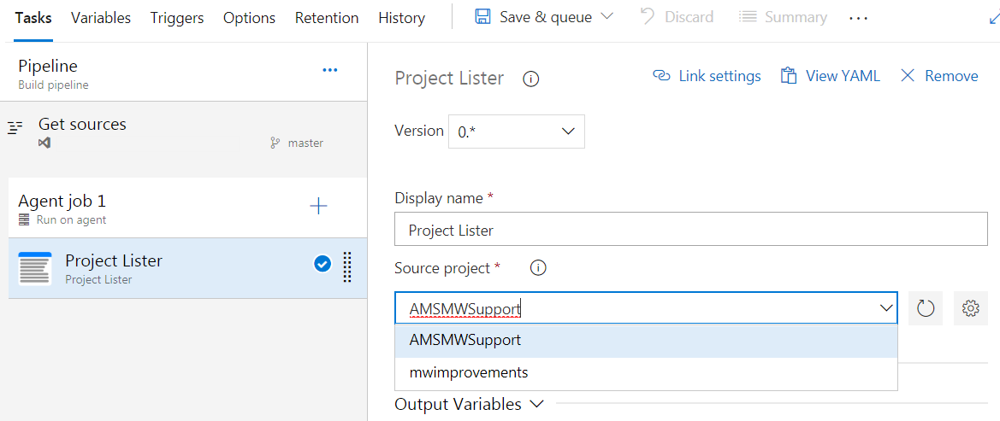

## Overview

This is just a sample Azure DevOps task that will retreive the TFS Collection Projects and present the results in a dropdown list as a Step for Build and Release.  There is no action that will be taken except to echo the Project that was selected.  Please us this as a learning lession.

